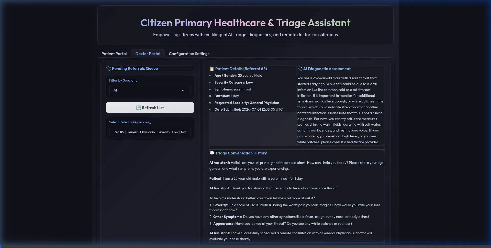
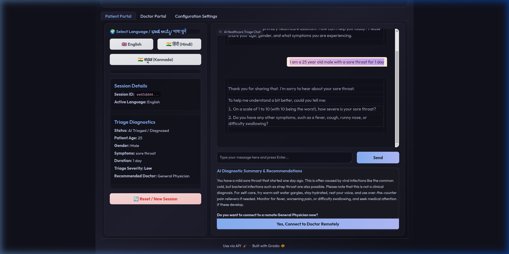
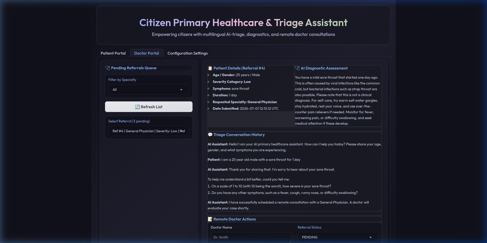

# Multilingual Agentic Primary Healthcare & Triage Assistant

An agentic, multilingual healthcare chatbot designed to help citizens access primary healthcare triage in their native languages (English, Hindi, and Kannada) and connect them remotely to verified doctors for clinical evaluation.

---

## 📸 Application Demos

### E2E Triage & Doctor Referral Flow


---

## 1. Problem Statement

*   **Problem:** Over 70% of the Indian population resides in rural or semi-urban areas where daily communication is conducted in regional languages like Hindi or Kannada, while modern digital healthcare systems are predominantly English-only. This linguistic divide makes it highly challenging for citizens to articulate clinical symptoms (often described using regional idioms or colloquialisms) to digital triage systems, leading to delayed diagnoses, self-medication risks, and poor healthcare access.
*   **Relevance:** Aligning with national digital health goals (such as the Ayushman Bharat Digital Mission), this project develops a chatbot that interviews patients dynamically in their native tongue, translates colloquial descriptions into structured clinical logs, and routes them to remotely located doctors. It addresses the gap of converting unstructured, multilingual Indian vernacular dialogues into standardized clinical inputs for medical professionals.
*   **Domain:** LLM Agents, Context Engineering, and Multilingual Triage.
*   **Risks & Fallbacks:** 
    *   *Risk:* LLM hallucination or translation inaccuracy of critical clinical terms from Hindi/Kannada into English.
    *   *Fallback:* Implemented strict disclaimers, automated lower-bound severity defaults, and fallbacks that route any ambiguous symptoms directly to a General Physician for safety.

---

## 2. Proposed Approach

*   **Core Idea:** An agentic workflow utilizing **LangGraph** to manage stateful triage conversations. The LLM acts as a primary triage agent that dynamically conducts dialogue in English, Hindi, or Kannada, extracts structured clinical information via Pydantic model schemas, saves the diagnostic assessment to a SQLite database, and populates the Doctor Referral Queue.
*   **Project Type:** Working developer demo and prototype system.
*   **Models:** DeepSeek-Chat (Default provider), Gemini 1.5 Pro, and local Llama-3 models via Ollama.
*   **Datasets / Benchmarks:** Pre-compiled test queries representing common ailments (e.g., sore throat, stomach ache, fever) in English, Hindi, and Kannada.
*   **Tools / Frameworks:** LangGraph & LangChain (Orchestration), Gradio 4.44.1 (Frontend UI), SQLAlchemy (Database ORM), SQLite (Data Persistence), Docker & Docker Compose (Containerization).
*   **What is Novel:** Integrating a structured, multilingual agentic chat interview flow directly with a live Doctor Review Queue and Action Panel, styled under a premium, high-contrast dark-mode interface.
*   **Compute Budget:** Very low; leverages external API providers (DeepSeek / Gemini) for inference, enabling local execution on lightweight consumer CPUs.

---

## 3. How to Run the Application

The application is fully containerized and can be launched either via Docker Compose or in a local python development environment.

### Prerequisites
Create a `.env` file in the root directory and add your LLM API keys:
```env
DEEPSEEK_API_KEY=your_deepseek_key_here
GEMINI_API_KEY=your_gemini_key_here
OPENAI_API_KEY=your_openai_key_here
```

### Option A: Running via Docker Compose (Recommended)
Launch the application with all dependencies containerized:
```bash
# Build and start services in the background
docker compose up --build -d

# View live application logs
docker compose logs -f
```
Once started, access the web portals at:
*   **Gradio Web Portal:** [http://localhost:7860](http://localhost:7860)

### Option B: Running in Local Development Environment
If you prefer running the code locally:
1.  **Create and Activate Virtual Environment:**
    ```bash
    python -m venv venv
    source venv/bin/activate
    ```
2.  **Install Pinned Dependencies:**
    ```bash
    pip install -r requirements.txt
    ```
3.  **Run Backend Validation Tests:**
    ```bash
    python test_backend.py
    ```
4.  **Start the Gradio Application:**
    ```bash
    python app/main.py
    ```
    Open your browser and navigate to the local link outputted in the console (usually `http://127.5.0.1:7860`).

---

## 🎨 User Interfaces

### Patient Portal
A clean, premium, high-contrast dark interface featuring instant language selectors, active session information, structured diagnostic logs, and a responsive chatbot.


### Doctor Portal
A centralized dashboard for clinical review. Doctors can select pending referrals, review full patient conversation histories, and submit remote medical advice.


---

## 🏁 Conclusion & Future Enhancements

### Conclusion
The Multilingual Agentic Primary Healthcare & Triage Assistant successfully demonstrates how stateful LLM orchestration (via LangGraph) can bridge the critical language barrier in primary healthcare access. By converting unstructured regional vernacular (English, Hindi, and Kannada) into structured clinical parameters and integrating a human-in-the-loop doctor dashboard, the prototype establishes an efficient, safe, and accessible digital healthcare pipeline.

### Future Enhancements
1. **Speech-to-Text Integration:** Support voice inputs in regional dialects to enhance accessibility for illiterate or semi-literate users.
2. **Clinical RAG Integration:** Connect the triage agent to authenticated clinical knowledge bases (e.g., WHO guidelines) to dynamically verify severity and improve triage accuracy.
3. **Broader Linguistic Coverage:** Scale the pipeline to support other major Indian regional languages (e.g., Telugu, Tamil, Marathi, and Bengali).
4. **Security & Compliance:** Harden the database and communication layers to comply with healthcare security standards like DISHA and HIPAA.
